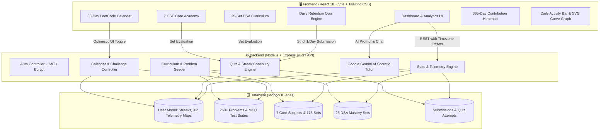

# 🧠 Neural Decay Guard: Comprehensive Interview Master Guide

---

## 📌 1. Project Overview & 2-Minute Elevator Pitch

### 💡 The Pitch
> **"Neural Decay Guard** is an AI-powered cognitive retention and algorithmic training platform built on the **MERN** stack (MongoDB, Express.js, React 18, Node.js) and integrated with **Google Gemini AI**.
>
> It directly addresses a critical problem in technical education: **Cognitive Decay**, based on the *Ebbinghaus Forgetting Curve*, where students and developers forget up to **70% of algorithmic concepts and CS core principles** within days if not systematically reinforced.
> 
> To solve this, the platform combines **mathematical spaced repetition**, a **strict 1-submission/day Daily Retention Quiz engine**, a **30-day LeetCode Challenge Calendar**, a **25-Set DSA Mastery Curriculum**, and **7 University-Grade CSE Core Subject Courses** (DBMS, OS, CN, OOP, etc.).
> 
> The system tracks 100% of user activity with a **timezone-synchronized telemetry pipeline**, real-time **XP velocity charts**, a **365-day contribution heatmap**, and an **AI Socratic Tutor** that guides users through hints rather than simply dumping answers."

---

## 🏗️ 2. High-Level System Architecture



---

## 🧱 3. Core Modules & Technical Implementation

### A. Mathematical Spaced Repetition & Decay Engine
* **Formula**: $R = e^{-\lambda t}$, where $R$ is cognitive retention stability, $t$ is days elapsed since last active practice, and $\lambda = 0.05$ decay factor.
* **Dynamic Recovery**: Every successful retention quiz submission reinforces stability back towards 100% and calculates the next optimal review interval.

### B. Strict 1-Submission-Per-Day Retention Engine & Streak Continuity
* **Problem Solved**: Prevents streak abuse and artificial point inflation.
* **Mechanism**:
  * Evaluates client local date (`clientTodayStr`) computed via client timezone offset (`tzOffset`).
  * If `user.lastQuizDate === clientTodayStr`, the quiz locks into a **"Synapses Reinforced"** state with a live midnight countdown timer.
  * Consecutive day check: `diffDays === 1` increments streak; `diffDays > 1` resets streak to 1; inactivity $\ge 2$ days drops streak to 0.

### C. Unified Telemetry & Timezone Synchronization
* **Problem Solved**: Cloud servers running in UTC (e.g., Render in UTC) cause dates to be misaligned by hours for users in IST (UTC+5:30) or PST (UTC-8:00).
* **Mechanism**:
  * Frontend sends `tzOffset = new Date().getTimezoneOffset()` with every API request.
  * Server dynamically computes client local timestamps: `clientTime = new Date(d.getTime() - (tzOffset * 60000))`.
  * Aggregates activity from 5 distinct data streams: Quizzes, LeetCode checks, CSE Core Sets, DSA sets, and direct activity logs.

### D. Socratic AI Tutor Integration
* Powered by **Google Gemini AI** with strict system prompts that act as a Socratic mentor: breaks down complex logic, asks clarifying questions, and gives hints without spoiling direct solutions.

---

# 🎯 4. Top 35+ Interview Questions & Detailed Answers

---

## 📂 Category 1: System Architecture & Design Choices

### Q1. What is the core problem Neural Decay Guard solves, and why did you build it?
**Answer**:
"Most coding preparation platforms suffer from a retention gap: candidates practice algorithms in high-intensity bursts (cramming), but due to the *Ebbinghaus Forgetting Curve*, over 70% of learned concepts decay within weeks. 

I built **Neural Decay Guard** to introduce systematic, spaced reinforcement into software engineering prep. It combines algorithmic problem-solving with spaced-repetition daily quizzes, continuous telemetry tracking, and an AI Socratic tutor to ensure long-term conceptual retention."

---

### Q2. Walk me through the high-level architecture of your application.
**Answer**:
"The application uses a modern **MERN** architecture:
1. **Frontend**: Built with **React 18**, **Vite**, and **Tailwind CSS**. It uses modular components for the 365-day Heatmap, customizable SVG trend graphs, interactive LeetCode calendar, and code practice workspaces.
2. **Backend**: A **Node.js** and **Express.js** REST API structured around MVC (Models, Views/Routes, Controllers, Services).
3. **Database**: **MongoDB Atlas** with Mongoose ODM, utilizing Map schemas, subdocuments, and indexing for user activity telemetry.
4. **External Services**: **Google Gemini API** for Socratic tutoring, and **Render Cloud** for automated continuous deployment."

---

### Q3. Why did you choose React with Vite over Create React App (CRA) or Next.js?
**Answer**:
* **Vite vs. CRA**: CRA is deprecated and uses Webpack with slow cold starts. Vite leverages native ES modules (ESM) and Rollup/Rolldown for instant HMR (Hot Module Replacement) and sub-second builds.
* **React SPA vs. Next.js**: Neural Decay Guard is a dashboard-heavy, authenticated single-page application requiring rich client-side interactivity, state transitions, and real-time SVG charting. A client-side SPA architecture minimized server rendering overhead and simplified hosting on Render while keeping state management snappy."

---

### Q4. How do you handle authentication and authorization across the platform?
**Answer**:
"We implement stateless **JWT (JSON Web Token)** authentication:
1. On login/registration, passwords are encrypted using **bcryptjs** (10 salt rounds).
2. Upon verification, the server signs a JWT containing the user's ID and role (`client` or `admin`).
3. An Axios interceptor in the frontend automatically attaches the JWT to the `Authorization: Bearer <token>` header for protected endpoints.
4. An `authMiddleware` on Express validates token integrity and signature before granting access to controllers."

---

## 📂 Category 2: Backend, Database & Telemetry

### Q5. How does the Telemetry Engine aggregate activities from multiple sources into a single graph and heatmap?
**Answer**:
"The telemetry engine in `statsController.js` performs multi-source ingestion across 5 distinct data streams:
1. `Submission` collection (topic practice and coding submissions)
2. `QuizAttempt` collection (daily retention quiz records)
3. `user.completedChallenges` (checked LeetCode problems on the calendar)
4. `user.courseProgress` (CSE Core Academy sets completed)
5. `user.learningPathProgress` (DSA Roadmap sets completed)

All timestamps are normalized into local calendar dates (`YYYY-MM-DD`) via client timezone offset math. The server computes both a `dailyActivityMap` (total counts) and a `dailyBreakdownMap` (categorized counts: quizzes, challenges, courses, XP) which feed the charts and heatmap in $O(N)$ time."

---

### Q6. How did you resolve the Timezone Offset Mismatch between Render (UTC) and the client browser?
**Answer**:
"This was a critical edge-case:
* Cloud servers on Render run in the **UTC** timezone (`Z`). If a user in India (UTC+5:30) solves a quiz at 2:00 AM on August 30th, the UTC timestamp is 8:30 PM on August 29th.
* If the server grouped by UTC date, today's activities would be assigned to yesterday, showing 0 activity for today.
* **The Solution**: The frontend passes `tzOffset = new Date().getTimezoneOffset()` and `clientDate` in query parameters. The backend applies:
  $$\text{clientTime} = \text{new Date}(d.\text{getTime}() - (\text{tzOffset} \times 60000))$$
  This guarantees that activities always map to the user's actual local calendar day regardless of server geography."

---

### Q7. How is MongoDB modeled to handle daily activity maps efficiently without unbounded document growth?
**Answer**:
"In `User.js`, we use Mongoose `Map` of numbers and mixed objects:
```javascript
dailyActivityMap: { type: Map, of: Number, default: {} },
dailyBreakdownMap: { type: Map, of: mongoose.Schema.Types.Mixed, default: {} }
```
Using key-value string maps indexed by date (`"YYYY-MM-DD"`) gives $O(1)$ lookups and updates. To prevent unbounded document growth over years, we only create keys for active days rather than pre-filling 365 empty days. For long-term historical records, submissions are stored in indexed separate collections (`Submission` & `QuizAttempt`)."

---

### Q8. How did you prevent streak reset bugs during server reboots?
**Answer**:
"Initially, an automated database reset snippet used during development was executing on database connection (`connectDB().then(...)`). Every time Render woke up from sleep or restarted, it reset streaks to 0.

I resolved this by:
1. Completely decoupling maintenance/reset scripts into isolated standalone scripts (e.g., `resetToday.js`) executed manually via CLI.
2. Making database initialization in `server.js` purely idempotent: it seeds missing curriculum sets without touching user document states.
3. Adding a fallback consecutive-day scanning algorithm in `statsController.js` that can compute streaks dynamically from active dates."

---

## 📂 Category 3: Daily Quiz, Streaks & Gamification

### Q9. Explain the algorithm behind the 1-Submission-Per-Day restriction.
**Answer**:
"To enforce spaced learning, users must not be able to spam daily quizzes in a single day:
1. When a user requests the quiz (`GET /api/daily-random`), the backend checks if `user.lastQuizDate === clientTodayStr`.
2. If true, it returns `{ alreadyCompleted: true, streak: user.quizStreak }` and the frontend locks the interface into a celebratory screen with a midnight countdown timer.
3. On submission (`POST /api/submitQuiz`), the backend performs validation again:
   ```javascript
   if (user.lastQuizDate === clientTodayStr) {
     return res.status(400).json({ alreadyCompleted: true, message: "Already completed today." });
   }
   ```
4. If valid, it computes the consecutive day difference `diffDays`:
   - If `diffDays === 1` $\rightarrow$ `user.quizStreak += 1`
   - If `diffDays > 1` $\rightarrow$ `user.quizStreak = 1`
   - If first time $\rightarrow$ `user.quizStreak = 1`
5. Updates `user.lastQuizDate = clientTodayStr` atomically and commits."

---

### Q10. What happens to a user's streak if they don't solve the quiz today?
**Answer**:
"The streak evaluation follows a 3-state timeline:
1. **Solved Today**: The user completed today's quiz; their streak is active and incremented.
2. **Solved Yesterday (Pending Today)**: The user completed yesterday's quiz but hasn't taken today's yet. Their streak is preserved throughout today (pending status) to give them until midnight.
3. **Missed a Day ($\ge 2$ days ago)**: If `diffDays \ge 2`, the user missed yesterday's quiz. The system drops their active streak to **`0 Days`**."

---

### Q11. How does the XP and Level progression system work?
**Answer**:
"Gamification uses an asynchronous XP calculation engine:
* **XP Gains**:
  * MCQ / Spaced-Repetition Quiz question: $+10\text{ XP}$
  * Daily Retention Quiz completion bonus: $+20\text{ XP}$
  * LeetCode Calendar Challenge check: $+50\text{ XP}$
  * DSA / Core Subject Set completion: $+100\text{ XP}$
* **Level Formula**:
  $$\text{Level} = \lfloor \frac{\text{XP}}{100} \rfloor + 1$$
* Whenever XP crosses a hundreds threshold, the backend flags `leveledUp: true`, unlocking new badge achievements."

---

## 📂 Category 4: Frontend, Charts & Visualizations

### Q12. How does the LeetCode-style 365-Day Contribution Heatmap work under the hood?
**Answer**:
"The heatmap (`LeetCodeHeatmap.jsx`) is built from scratch without bulky third-party chart libraries:
1. It computes a rolling 12-month window (52 weeks $\times$ 7 days = 364 days).
2. It groups days into Sunday-to-Saturday columns, calculating initial padding for the first day of each month.
3. For each date cell, it performs an $O(1)$ lookup in `dailyActivityMap[dateStr]`.
4. Color intensity is applied using threshold quantization:
   - $0$ tasks: Dark slate background (`bg-slate-850`)
   - $1\text{--}3$ tasks: Subtle Emerald (`bg-emerald-950/80`)
   - $4\text{--}7$ tasks: Medium Emerald (`bg-emerald-700`)
   - $8+$ tasks: Bright glowing Emerald (`bg-emerald-400 shadow-md`)
5. Interactive hover tooltips display the exact date and submission count."

---

### Q13. Why was the Daily Activity bar graph initially dark, and how did you debug and fix it?
**Answer**:
"I diagnosed a CSS rendering bug in Tailwind CSS:
* The component was using `from-[var(--accent-primary)]/80` to apply 80% opacity to a CSS variable.
* However, Tailwind's slash opacity syntax (`/80`) requires CSS variables to be defined as space-separated RGB numbers (`99 102 241`), not hex values (`#6366f1`).
* Because the variable was a hex string, the browser evaluated `linear-gradient(from #6366f1/80)` as invalid CSS and silently discarded the background, rendering the bar transparent until selected.
* **The Fix**: I replaced it with multi-stop Tailwind gradient utilities (`bg-gradient-to-t from-indigo-600 via-teal-500 to-cyan-400`), which reliably render vibrant gradient cylinders across all browsers on initial load."

---

### Q14. How does the SVG Smooth Curve Trend View work in DailyActivityGraph?
**Answer**:
"The component supports both bar charts and a continuous SVG curve:
1. Given $N$ data points $(x_i, y_i)$, it calculates canvas coordinates:
   $$x = \text{paddingX} + \frac{i}{N - 1} \times (\text{width} - 2\cdot\text{paddingX})$$
   $$y = \text{height} - \text{paddingY} - \frac{\text{value}}{\text{maxVal}} \times (\text{height} - 2\cdot\text{paddingY})$$
2. It generates a smooth cubic Bézier curve (`C` command in SVG path) by calculating midpoints between adjacent coordinates.
3. It closes the path along the bottom axis to render an illuminated SVG linear gradient fill below the trendline."

---

## 📂 Category 5: AI Integration & Socratic Tutor

### Q15. How did you integrate Google Gemini AI, and why did you design it as a Socratic Tutor?
**Answer**:
"I integrated the **Google Gemini API** (`@google/genai` SDK) in the backend. 

Instead of standard LLM chatbots that simply output copy-paste solutions (which degrades critical thinking and exacerbates neural decay), I designed system prompts that enforce the **Socratic Method**:
1. It analyzes the user's problem context and submitted code/answer.
2. It identifies conceptual bugs or edge-case oversights.
3. It replies with guiding questions, algorithmic hints, and time complexity tradeoffs, prompting the user to discover the fix themselves."

---

### Q16. How do you handle API keys and credentials safely?
**Answer**:
"API keys for Google Gemini, MongoDB Atlas, and JWT secrets are stored exclusively in backend `.env` files and managed via Render Environment Variables in production.
* The frontend never communicates directly with the Gemini API; all requests flow through authenticated Express backend routes.
* `.env` is explicitly included in `.gitignore` to prevent secret leaks to public GitHub repositories."

---

## 📂 Category 6: Curriculum, DSA & CSE Core Subjects

### Q17. How is the 25-Set DSA Mastery Curriculum structured?
**Answer**:
"The DSA Curriculum (`DSALearningPath.js`) spans 25 progressive sets from foundational to advanced:
* **Sets 1–5**: Arrays, Two Pointers, Sliding Window, Prefix Sums
* **Sets 6–10**: Linked Lists, Fast/Slow Pointers, Stacks, Queues
* **Sets 11–15**: Binary Trees, BSTs, Tree Traversals, DFS/BFS
* **Sets 16–20**: Heaps, Priority Queues, Graphs (Dijkstra, Topological Sort)
* **Sets 21–25**: Dynamic Programming (1D, 2D, Knapsack), Tries, Bit Manipulation

Each set contains 5 conceptual MCQs, 3 curated LeetCode problem recommendations, and direct workspace links."

---

### Q18. How are the 7 CSE Core Subject Courses generated and certified?
**Answer**:
"The 7 Core Subject courses cover:
1. Database Management Systems (DBMS)
2. Operating Systems (OS)
3. Computer Networks (CN)
4. System Design & Distributed Systems
5. Object-Oriented Programming (OOP)
6. Computer Organization & Architecture (COA)
7. Software Engineering & Agile Methodologies

Each course contains **25 unique sets** (175 sets total with 875+ MCQs). When a user completes all sets in a subject with $\ge 80\%$ accuracy, the backend automatically issues a verifiable course certificate object linked to their profile."

---

## 📂 Category 7: Behavioral & Problem Solving (STAR Method)

### Q19. Describe a major technical challenge you faced while building this project and how you solved it.
**Answer (STAR Method)**:
* **Situation**: After deploying to Render, the Daily Activity Graph showed 0 activities for Indian users practicing at night, and streaks were resetting unpredictably.
* **Task**: I needed to fix both the UTC-vs-Local timezone date grouping and prevent server reboot hooks from wiping user telemetry.
* **Action**:
  1. I audited `statsController.js` and discovered that timestamps were being grouped using server UTC time (`ISOString`). I updated the API to accept client `tzOffset` and normalize timestamps into client local dates.
  2. I discovered that a database seed hook in `server.js` was running a reset query on boot. I removed the startup reset, made curriculum seeding idempotent, and added `dailyActivityMap` to the Mongoose schema.
* **Result**: All user activity immediately synced across Sat 29 and Sun 30, streak continuity remained 100% persistent across server restarts, and the contribution heatmap displayed accurate metrics.

---

### Q20. If you had another month to work on this project, what would you add or improve?
**Answer**:
"I would focus on three major enhancements:
1. **Remote Code Execution Engine (Judge0 API)**: Embed an in-browser code editor with multi-language execution (Python, Java, C++, TypeScript) and automated test case evaluation.
2. **WebSocket Real-Time Peer Battles**: Add 1v1 spaced repetition quiz duels using **Socket.io** to increase engagement through real-time multiplayer competition.
3. **Spaced Repetition Algorithm Upgrade (SuperMemo SM-2)**: Transition from a fixed decay constant ($\lambda=0.05$) to an adaptive SuperMemo SM-2 / Anki algorithm that adjusts review intervals per question based on individual response quality and response latency."

---

### Q21. How did you ensure data integrity and optimistic UI updates on the LeetCode Calendar?
**Answer**:
"When a user clicks a checkmark on a calendar day in `DailyCodingChallenge.jsx`:
1. **Optimistic Update**: The UI updates the checkbox state and increments the monthly progress counter instantly for zero latency feel.
2. **Backend Sync**: It fires a `POST /api/coding/toggle-calendar-day` request with `{ challengeDate }`.
3. **Error Rollback**: If the network fails or server returns an error, a `.catch()` block rolls back the optimistic state and alerts the user, ensuring the frontend always stays consistent with MongoDB."

---

## 📋 Quick Reference Sheet for Your Interview

| Topic | Key Term / Metric | What to Mention |
| :--- | :--- | :--- |
| **Core Concept** | Ebbinghaus Forgetting Curve | Spaced-repetition cognitive reinforcement ($R = e^{-\lambda t}$) |
| **Daily Quiz** | 1 Submission / Day | Midnight countdown timer, strict streak driver |
| **Telemetry** | Timezone Normalization | `d.getTime() - (tzOffset * 60000)` eliminates UTC drift |
| **Database** | MongoDB Atlas + Mongoose Maps | Key-value date maps for $O(1)$ updates |
| **Frontend** | React 18 + Vite + Tailwind | Custom SVG curve generation, 365-day Heatmap |
| **AI Module** | Google Gemini API | Socratic mentoring (hints and guiding questions) |
| **Curriculum** | 25 DSA Sets + 7 Core Courses | 175 subject sets, 875+ MCQs, 260 coding challenges |
